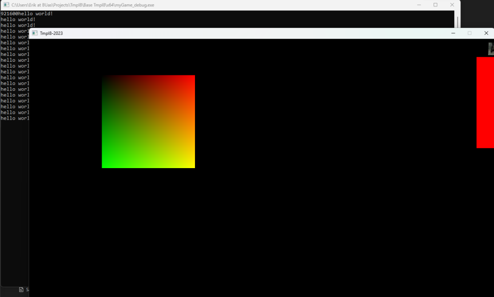
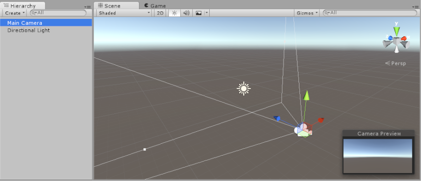
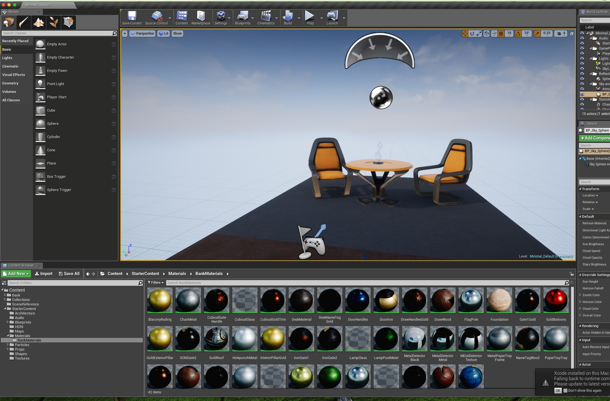
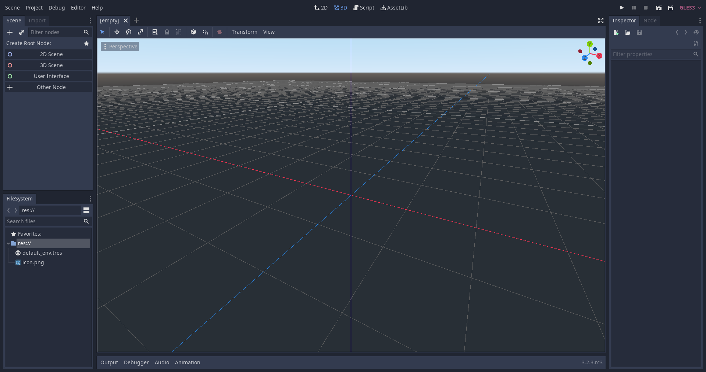

# How to make a Scrolling Tile Map without an engine in C++
## Prerequisites for this tutorial:  
- Visual studio, [here](https://www.3dgep.com/
cpp-fast-track-1-getting-started/) is a step by step tutorial to download it, you can get the latest version of this IDE which is 2022 at the time of writing this.
- [Basic template](https://github.com/jbikker/tmpl8), explained below.
- [Tiled](https://www.mapeditor.org/), a free software for drawing tile maps.

---
## About the template
So for my school project we had to make a simple 2D platformer. The only requirement was to use [this](https://github.com/jbikker/tmpl8) template, which is a minimalistic framework for making 2D games in C++.
Minimalistic means you can more or less write to pixels and there are some math functions.

Here is how it looks when you run it the first time:
)

Of course not all mechanics from the project will be explained, but if you are interested in any of them let me know, and I will make specific tutorials.
# Importance of making projects without an engine

So there are hundreds of engines that can help you make a game much faster, Why the hassle of not using one? Why remake most of the already established systems that are already fine-tuned to be as efficient and generic as possible?

  

The most important reason, for me, at least, is confidence. Remaking all this will make you confident in your abilities as a programmer. 

Curiosity is another good reason. Most people use engines on a daily basis, but don’t know what is behind the abstraction. What other way is better to learn what is in a black box, by making one yourself?

You may have heard of these titiles which are made inside an in house engine:

 

> The main idea is that some engines are `born` out of games.
{: .prompt-info }

And finally, to maybe break the status quo. I feel that most engines are tailored to some kind of ideal experience of games. That means they expect basic blocks of functionality that makes up a game. By building a game brick by brick, you are more likely to discover new alternative ways to create things. You can design your game with your own building blocks, not the ones that an engine provides. Basically, you can make your own engine for your own unique game.

> That is at least what I am telling myself for starting `[this](https://tycro-games.github.io/posts/starting-a-new-game-engine/) project`.
{: .prompt-tip }

Firstly, you probably need some way to render pixels to the screen. On that front, I've got you covered. Just use this good free template, I also used the same one to build my project. If you wander through it and find yourself very confused about certain aspects of it. 

Don’t worry, it is ***bad*** because it offers a base  that you **should**  try to modify and change to suit your needs.  It is intentionally made, so you can optimize it further or add new functionality, but you do get the minimum.

 A window for your game, some math, a bit of utility, basic shapes to draw on the screen and the weird notion of a Sprite and Surface which we will maybe explore deeper into another video.

By the way, you don’t really have to use the stuff provided, if you don’t like the Surface class, make your own, or modify it to suit your needs.

You can find the template in the description. After downloading it, you can press F5 and hopefully a hideous window is going to pop up. This is what it is so nice about this template, it just works.

# ///Drawing a tile map

[some footage of 2D games]

I will keep the video short and sweet so lets have a scrolling tile map, it is probably the most used gimmick since 2D games were invented 1000 years ago. The most easy way to represent a tile map is to store an array of integers that represent the index of the tile that goes there. It goes without saying, but we also need a tile palette, so we can draw each tile to its corresponding index. We could also use a convention for empty tile, like 0.

To illustrate this better, let’s say we have this array, it corresponds with this actual tile map. This is fine so far, but it is quite hard to visualize how the tile map would look without running the actual game. Tiled comes to rescue, link in description, Tiles is another free software for drawing tile maps and using it everywhere basically. As you can see, I could open a new file, add a tile palette, draw the tile map and save the file. Now, if you would open the same file in any text editor, you would find that this is just a bunch of text, which can be imported into our own project. We just need to parse the CSV into our array, now that task is may take some time, feel free to try it, but I just happen to have a basic CSV parser from my project, link in the description.

[diagram that shows how to copy pixel by pixel]

Ok, now we have to make some code that copies the tile from the palette image to the screen. Well, images and our screen is made out of pixels, so we can copy from the source to the destination. 

[Show some Stack Overflow responses on dynamic memory management]

Unfortunately for us, Surfaces do store pixels, but not in a 2D array how it is trivial to understand but a 1D array. We can use this formula to traverse the array as it was 2D, we might want 1D arrays over 2D arrays because dynamic memory is much more inefficient in 2D than 1D. 

[show how formula works visually]

After you get your head around how this formula works, you know more or less how you can copy the value of each pixel from the palette and  draw it to the corresponding screen pixel. 

Let’s start small, and draw just one tile to the screen. That is beautiful, isn’t it? Of course, there are already optimizations to be made, but just let’s be happy about this big step towards our own tile map draw method.

Next we have to do some little adjustments to get the as the source the tile we need and to adjust the drawing to the screen.

# ///Scrolling Tile map

Ok, we are nearly done, we just need to add some code that moves our map. And we get, some awful C++ errors. The direct translation would be: 

- You just tried to write outside the screen!

Before I explain how to add a scrolling tile map, feel free to have a go at it and try to do your best solving this, of course if you don’t mind listening to a random guy on YouTube giving you an answer and ruining all the fun you could have coming up with a solution.//might change

Adding some code to check if a tile is out of screen should be easy enough, we just need to check if we are below 0 or above our screen resolution.

Let’s try one more time!

[Disclaimer, there are better ways to solve this, but let's just go along with this for now]

So it seems to work, but we don’t get partial tiles. We need to find a way to render tiles partially to the screen. Let’s think about the logic for one lonely tile at each corner and edge of the screen, we can observe how it clamps to the screen resolution when it is off-screen. 

We can add the amount we clamped to the destination pixel, but then we are copying the wrong pixels! It is still as it had been if the tiles were completely on-screen!

So we also need to add the amount we clip to the source pixel, in this way we can draw a partial tile to the screen.

[Show how it looks in game]

Our lonely tile seems to work perfectly, so when we add the whole tile map, everything works as it is expected. 

# ///outro

Ok, I guess that’s it for this tutorial. I hope I sparked your interest, in adding more interesting mechanics and making a 2D platformer. You could also copy a game, so you don’t have to make the game design yourself. For my school project I had to recreate a platformer with some mechanics from Pitfall Mayan Adventure which is an ancient game from the 90. 

If you want, you could also get some inspiration from my project. You can leave a comment below, about how badly I structured my game project, or any other mechanics that you would like to be explained, and I might make a video about that concept. In the description, I will have a link to everything discussed, as well as some links to resources about the template and a discord server with people that know how the template works. Yeah, that’s it, thanks for staying until the very end, Bye!

## Feedback